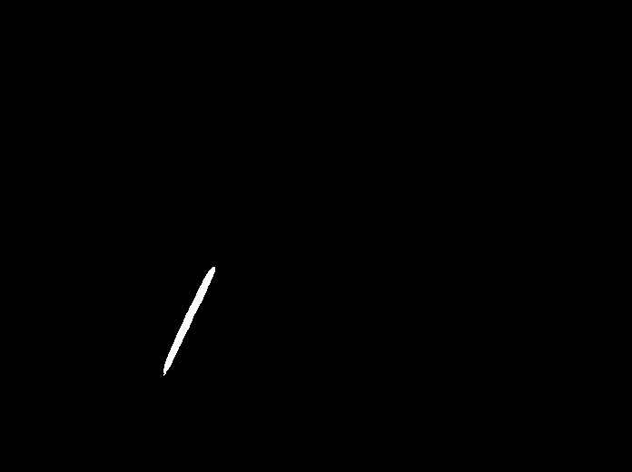

Worms Detection Report
==========================

<!-- pandoc -o output.docx -f markdown -t docx summative.md -->

## Reading Image Channels

Both channels are loaded as 16 bit grayscale matrices. Images are normalised in order to preserve the data in the images. They are then subject to a division in order to make the values fit within an 8 bit matrix.

## Image and Background segmentation

**GFP** _(W2)_ - is segmented starting with a Gaussian blur, followed by Adaptive Mean Thresholding. In the event that a border is still present, A mask is created by segmenting the background, eroding it, and merging the mask and the base image. Non-worm objects are removed using contours.

**Brightfield** _(W1)_ - Is subject to a Gaussian blur, followed by a Binary Threshold. Like _W2_, it is checked for particles. There has been difficulty in extracting as many worms as possible due to image lacking sufficient worm data.

W2 is used as the base file, and W1 is used as a complimentary assistance file. In the event that worm information is absent in W2 as a result of processing, information from W1 may assist in recovering it.

Overall, this methods works very well, but there have been exceptions; most notably in `A03` where a large trail was included in the segmentation. This method detects all objects, however.

## Worms Detection

A skeleton of the workspace image is created using Zhang Suen's Algorithm [1][2]. This is cached locally.

### Object Labelling

Worm blobs are used as a mask to retrieve its skeleton. The skeleton is used to find endpoints. If there is 2 or less endpoints, then it is a worm. (1 end point assumes that the worm is balled in a circle.) Each individual worm blob is saved locally.

### Counting

Counting is deduced with the number of worm endpoints. The formula `no_worms = Math.floor(len(endpoints)/2)` assumes that each worm has two endpoints. This is provided that the skeleton produced is very accurate. 

## Detection of Clustered Worms

Each skeleton's pixels are checked for its number of pixel neighbours. 1 Neighbouring pixel is an endpoint. Two pixels means it's in the middle of the worm. More than 2 suggests an intersection. There have been issues with this method, where the skeleton uses more than two pixels to create a curve in the worm. This could be solved by giving the neighbouring worm base a checking library, allowing it to check for patterns. 

Collisions are detected in green; the actual collision in the image is in the red circle. Spots of collisions are most prominent when the worms curve.

## Live/dead Worm Classification

**Shape Detection** is done by using skeleton endpoints. A length is deduced with the endpoints using Pythagoras. This is compared to the number of pixels in the skeleton. A percentage can be deduced. The higher the percentage, The straighter the worm, and the more likely it is to be dead. If there is one endpoint, then the worm is in a circle - it is definitely alive.

<!-- histograms were considered but is too complex, not enough detail in the worm to calculate blackhat and whitehat -->

**Texture Detection** - Worms are checked against its Gaussian blur by calculating the euclidean distance. The results (A percentage of difference) are highly volatile due to lighting amongst other issues affecting the image. The higher the difference, the more uneven in texture it is.

The two percentages are weighted and combined to give a `dead_percentage`. If this value is greater than the `death_threshold` it is classified as dead. Each worm's contour is coloured and displayed on a image (which is saved locally for displaying later).

# Evaluation

Results are saved in a `.csv` file, which can be found in `/data/results_data/` directory from where the scripts are run. Coverage and Worm Count are checked against the ground truths. Overall Coverage is measured using pixel checking.

| Overall Coverage Percentage | Overall Classified Worm Count Percentage | Overall Worm Count Percentage (Including Clusters) |
| --------------------------- | ----------------------------- | ----------- |
| 93.30927835 				  |	60.43298969					  |	90.80412371 |

Overall, the segmentation coverage is fairly accurate, having a 93% accuracy. This could be improved with better source material. Classifiable Worm count is fairly low due to the number of clustered worms. The image has a good percentage of worms counted (including clusters). Verification on the status of the biological status of a worm is absent, so checking our statistics on dead worms is not possible.

## References

[1] T.Y. Zhang and C.Y. Suen. A fast parallel algorithm for thinning digital patterns. Image Processing and Computer Vision, 27:235–239, 1984.
[2] Linbo Jin, Skeletonization by Zhang-Suen Thinning Algorithm, Python and Matlab Implementation. 2014. https://github.com/linbojin/Skeletonization-by-Zhang-Suen-Thinning-Algorithm